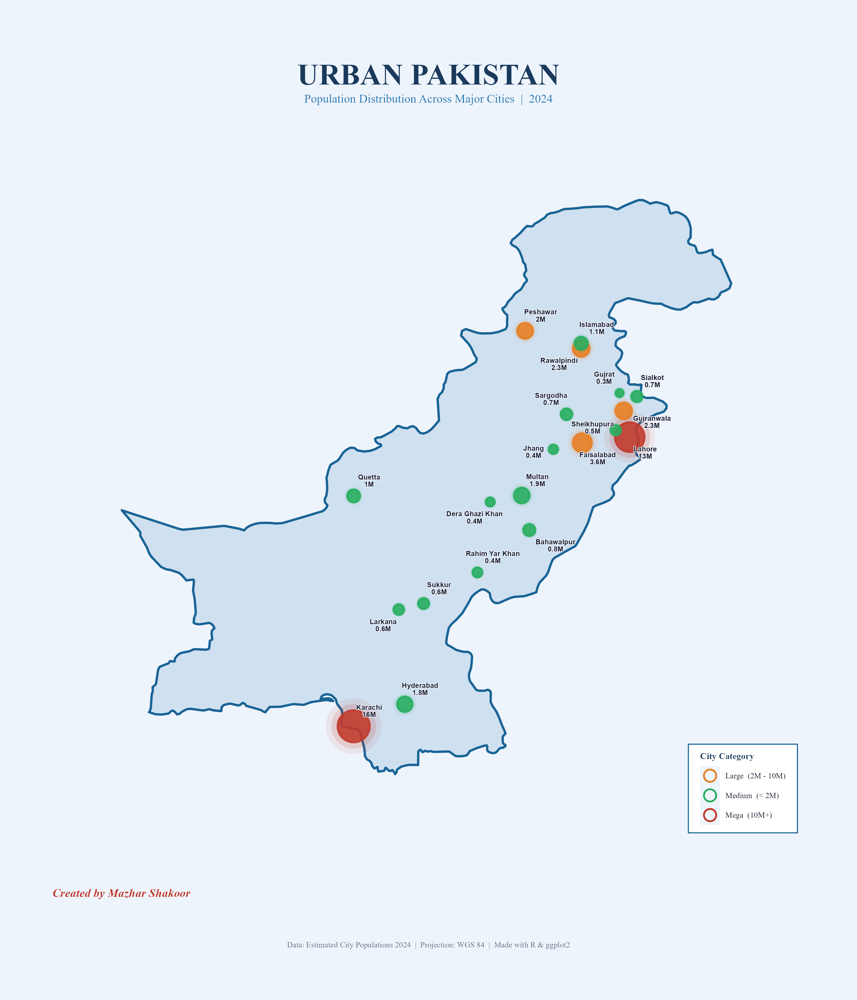

# 🗺️ Urban Pakistan — Population Bubble Map

A professional GIS map showing population distribution
across 20 major cities of Pakistan using bubble mapping technique.

## Preview

## Tools Used
- R
- ggplot2
- sf
- rnaturalearth
- ggrepel

## Data Sources
- Natural Earth
- Estimated City Populations 2024

## How to Run
1. Open `pakistan_cities_map_final.R` in RStudio
2. Run `options(timeout = 300)` first
3. Install packages if running for the first time
4. Select all and press Ctrl + Enter

## Created by
**Mazhar Shakoor**
